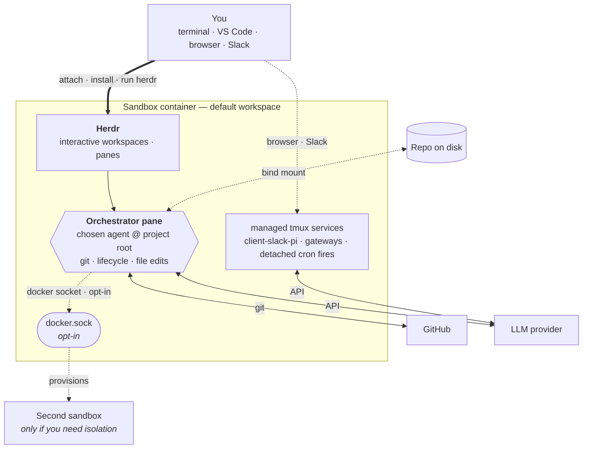

# AGRO

AGRO is a **portable harness**: one repository per sandbox. AGRO wraps your project in an isolated Docker container and versions the container's state in git. The repository tracks the agent's identity, skills, crons, and memory. The sandbox keeps the agent — Claude Code, Codex, Pi, or another agent you choose — off your host machine. The agent owns its workspace, runs against your code, and wakes itself on a schedule through a croner runtime.

## What is AGRO?

AGRO is a single repository, and the repository is your harness. The repository boots one Docker container: the sandbox. The sandbox wraps your project.

Run `agro sandbox install docker` to start the sandbox. Attach to the sandbox from your terminal or from VS Code. Let your chosen agent work on the project over time.

The harness is a git repository, so git tracks and versions its whole setup. The setup stays reproducible and portable.

One host CLI, `agro`, drives the whole lifecycle for every agent; AGRO has no per-agent CLI. The croner runtime that ships in the sandbox image wakes the agent on a schedule.

Key capabilities:

- **One repository, one sandbox.** The portable harness is one repository. The repository boots one container. The agent owns its workspace inside that container. Your host machine stays clean because you never run agents directly on the host.
- **Markdown-defined crons.** Files in `crons/*.md` declare schedules. A croner runtime inside the container fires each file's body as an agent prompt on its schedule. The agent works on each fired prompt without your attention.
- **Host dependencies: Docker, Git, and Node.js 20 or later.** The host needs no Python, no pnpm, and no agent CLIs. Node.js runs only the `agro` CLI on the host. If Node.js is missing, `get-agro.sh` installs it. See [Prerequisites](/docs/installation#prerequisites).
- **Cloudflared previews.** Share sandbox app ports through Cloudflared tunnels. SSH and pack-supplied services stay as opt-in Docker Compose overlays.
- **Multi-agent messaging.** Bridge Slack and other messengers to a Pi agent with the [`pi-messenger-bridge`](/docs/integrations/slack) npm package. SSH and pack-supplied services stay as opt-in Docker Compose overlays.

## How it works

The harness uses Docker Compose to build a sandbox image from `.devcontainer/`.

1. Run `agro sandbox install docker` to start the sandbox.
2. Run `agro shell <name>`, or attach from VS Code.
3. Run `agro tool install herdr`. The sandbox installs no tool at boot; you install tools yourself.
4. Run `herdr`.
5. Authenticate with GitHub and with your chosen agent provider.
6. Launch agents from Herdr panes.

`agro stop` preserves state. `agro destroy` deletes state; `agro destroy` asks for confirmation before it deletes the volumes. Every `agro` verb runs `.agro/scripts/docker-compose.sh`. See [lifecycle commands](/docs/lifecycle-commands).

The primary agent pane at the project root inside Herdr is the **orchestrator**. The orchestrator handles git, sandbox lifecycle, and most file edits.

The Docker socket is off by default. See [security-considerations.md](security-considerations.md#3-sandbox-isolation--the-docker-socket-caveat--enforced-with-a-caveat) for the risk. When the operator enables the Docker socket, the orchestrator can also drive other containers and edit files inside them over that socket. Most day-to-day work needs only the orchestrator pane.

Use the host shell only for an action the container cannot perform, such as adding a bind-mounted volume. Adding a bind-mounted volume requires editing `.devcontainer/docker-compose.yml` and restarting the sandbox.

Create a second **sandbox** only when you need isolation: an independent identity, branch, or provider key running on its own. Most users do not need a second sandbox.

Inside the sandbox, systemd runs `scripts/cron-runtime.ts` as `agro-cron.service`. The `agro-cron.service` reads `crons/*.md` files and fires each file's body as a prompt to the configured agent on the file's declared schedule.

## How to read these docs

If you are new, follow this order:

1. [Installation](/docs/installation) — install Docker, Git, and the `agro` CLI.
2. [Quickstart](/docs/quickstart) — go from zero to a running sandbox in under five minutes.

If you already have a sandbox running, jump directly to the page you need.

## Where to get help

- Source code and issues: [github.com/mifunedev/agro](https://github.com/mifunedev/agro)
- Learning material: [Resources](/docs/resources)
- Philosophy: [How AGRO embodies compound engineering](https://github.com/mifunedev/agro-web/tree/main/blog) — why each unit of work here should make the next one easier.

[Connecting to the Sandbox](/docs/connecting)
