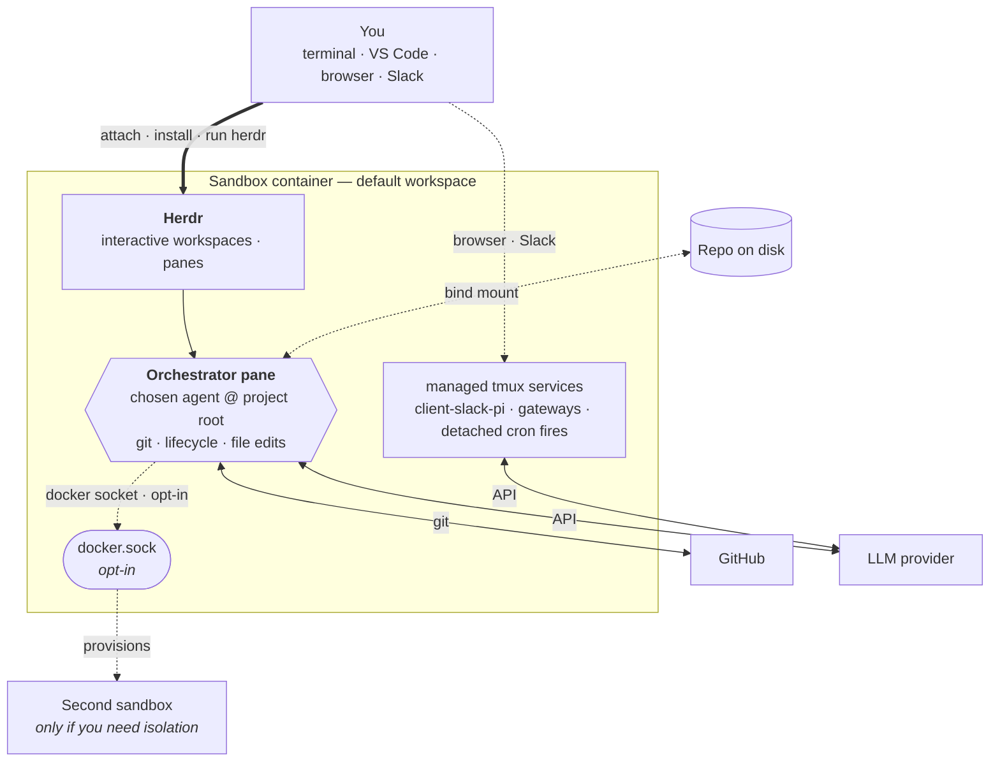

# AGRO

AGRO is a **portable harness**. AGRO uses one repository per sandbox. The sandbox is an isolated Docker container that holds your project and its state. Git tracks the agent's identity, skills, crons, and memory inside the repository. The sandbox keeps the agent off your host machine. You choose the agent: Claude Code, Codex, Pi, or another agent. The agent owns its workspace, runs against your code, and wakes itself on a schedule through a croner runtime.

## What is AGRO?

AGRO is one git repository that acts as your harness. The repository starts one Docker container: the sandbox. The sandbox holds your project. Run `agro sandbox install docker` to start the sandbox. Attach to the sandbox from your terminal or from VS Code. Your chosen agent then works on the project over time. Git tracks and versions the whole setup, so the setup stays reproducible and portable. One host command-line tool, `agro`, drives the whole lifecycle. AGRO runs no separate command-line tool per agent. The croner runtime in the sandbox image wakes the agent on a schedule.

Key capabilities:

- **One repo, one sandbox.** One repository starts one sandbox container. The agent owns its workspace inside the sandbox. The sandbox keeps agents off your host machine.
- **Markdown-defined crons.** Each file in `crons/*.md` declares one schedule. The croner runtime inside the sandbox fires each file's body as a prompt to the agent, on that schedule. The agent then works without your attention.
- **Host dependencies: Docker, Git, and Node.js 20 or later.** The host needs no Python, no pnpm, and no agent command-line tools. Node.js runs only the `agro` CLI. Run `get-agro.sh` to install the `agro` CLI when the CLI is missing. See [Prerequisites](/docs/installation#prerequisites).
- **Cloudflared previews.** Cloudflared tunnels share sandbox app ports. SSH and pack-supplied services stay optional Docker Compose overlays; add them when you need them.
- **Multi-agent messaging.** The [`pi-messenger-bridge`](/docs/integrations/slack) npm package bridges Slack, and other messengers, to a Pi agent. SSH and pack-supplied services stay optional Docker Compose overlays; add them when you need them.

## How it works

Docker Compose builds the sandbox image from `.devcontainer/`. Follow these steps to start and use the sandbox.

1. Run `agro sandbox install docker` to start the sandbox.
2. Run `agro shell <name>`, or attach from VS Code, to attach to the sandbox.
3. Run `agro tool install herdr` inside the sandbox to install Herdr. The sandbox installs nothing at boot before this step.
4. Run `herdr` to start Herdr.
5. Authenticate GitHub and your chosen provider inside Herdr.
6. Launch agents from Herdr panes.

Run `agro stop` to stop the sandbox and keep its state. Run `agro destroy` to delete the sandbox; `agro destroy` asks for confirmation before it deletes the volumes. Every `agro` verb calls `.agro/scripts/docker-compose.sh`. See [lifecycle commands](/docs/lifecycle-commands) for the full verb reference.

The primary agent pane at the project root, inside Herdr, is the **orchestrator**. The orchestrator handles git, sandbox lifecycle commands, and most file edits.

The Docker socket is off by default. When you enable the Docker socket (see [security-considerations.md](security-considerations.md#3-sandbox-isolation--the-docker-socket-caveat--enforced-with-a-caveat)), the orchestrator can also drive other containers and edit files inside them over that socket.

When the container cannot do a task, use the host shell. One example: adding a new bind-mounted volume. That task needs a change to `.devcontainer/docker-compose.yml` and a sandbox restart.

When you need isolation — an independent identity, branch, or provider key that runs on its own — **create a second sandbox**. Most users do not need a second sandbox.

Inside the sandbox, systemd runs `scripts/cron-runtime.ts` as the `agro-cron.service` service. The service reads `crons/*.md`. For each file, the service fires the file's body as a prompt to the configured agent, on the file's declared schedule.

## How to read these docs

If you are new to AGRO, read these pages in order:

1. [Installation](/docs/installation): install Docker, Git, and the `agro` CLI.
2. [Quickstart](/docs/quickstart): start a running sandbox in under five minutes.

If you already have a running sandbox, go to the page you need.

## Where to get help

- Source code and issues: [github.com/mifunedev/agro](https://github.com/mifunedev/agro)
- Learning material: [Resources](/docs/resources)
- Philosophy: [How AGRO embodies compound engineering](https://github.com/mifunedev/agro-web/tree/main/blog) — why each unit of work here makes the next unit of work easier.

[Connecting to the Sandbox](/docs/connecting)
