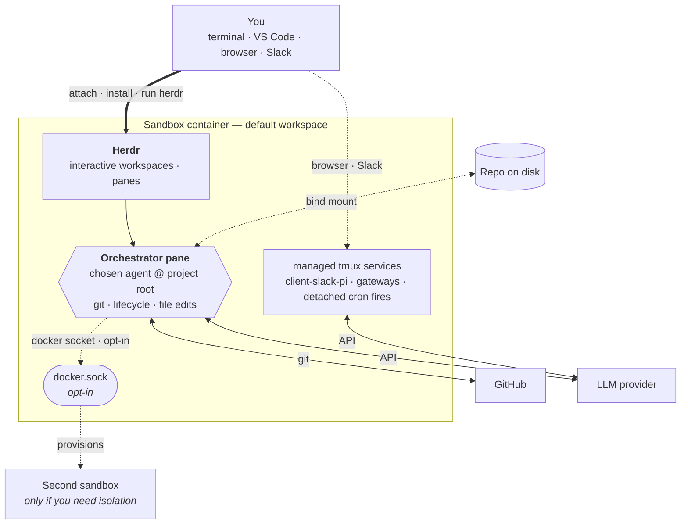

# AGRO

AGRO is your portable harness: one repository per sandbox. AGRO wraps your project in an isolated Docker container and versions the container's state in git. The repository tracks the agent's identity, skills, crons, and memory. The sandbox keeps the agent — Claude Code, Codex, Pi, or another agent you choose — off your host machine. The agent owns its workspace and runs against your code. The agent wakes on a schedule through a croner runtime.

## What is AGRO?

AGRO is a single repository that acts as your harness. AGRO boots one Docker container, the sandbox. AGRO wraps your project inside the sandbox. Run `agro sandbox install docker` to start the sandbox. Attach to the sandbox from your terminal or from VS Code. Let your chosen agent work the project over time. The harness is a git repository, so git tracks and versions the whole setup. The setup stays reproducible and portable. AGRO runs one agent per sandbox: one host CLI, `agro`, drives the whole lifecycle. The croner runtime in the sandbox image wakes the agent on a schedule.

Key capabilities:

- **One repository, one sandbox.** Your portable harness is one repository. The repository boots one sandbox. The agent owns its workspace. Your host machine stays clean because you run no agent directly on it.
- **Markdown-defined crons.** Each file in `crons/*.md` declares a schedule. An in-container croner runtime sends each file's body as an agent prompt, so the agent works on its declared schedule without your input.
- **Host dependencies: Docker, Git, and Node.js ≥ 20.** Your host needs no Python, no pnpm, and no agent CLI. Node runs only the `agro` CLI on your host. `get-agro.sh` installs `agro` when it is missing. See [Prerequisites](/docs/installation#prerequisites).
- **Cloudflared previews.** Share sandbox app ports through Cloudflared tunnels. SSH and pack-supplied services stay optional Docker Compose overlays.
- **Multi-agent messaging.** Bridge Slack, and other messengers, to a Pi agent with the [`pi-messenger-bridge`](/docs/integrations/slack) npm package. SSH and pack-supplied services stay optional Docker Compose overlays.

## How it works

The harness uses Docker Compose to build a sandbox image from `.devcontainer/`. Run `agro sandbox install docker` to start the sandbox. Attach to the sandbox with `agro shell <name>`, or with VS Code. No tool installs at boot. Run `agro tool install herdr`, then run `herdr` to install and start Herdr. Authenticate GitHub and your chosen provider. Launch agents from Herdr panes. `agro stop` preserves sandbox state. `agro destroy` is the destructive teardown: `agro destroy` asks for confirmation before it deletes the volumes. Every one of these verbs runs `.agro/scripts/docker-compose.sh` — see [lifecycle commands](/docs/lifecycle-commands).

The primary agent pane at the project root inside Herdr is your orchestrator. Git, sandbox lifecycle commands, and most file edits flow through the orchestrator's workspace. The Docker socket is optional and off by default; see [security-considerations.md](security-considerations.md#3-sandbox-isolation--the-docker-socket-caveat--enforced-with-a-caveat) for the risk. Enable the Docker socket to let the orchestrator drive other containers and edit files inside them over the socket. With the Docker socket enabled, the orchestrator handles almost every task without the host shell. Use the host shell only for a task the container cannot do, such as adding a new bind-mounted volume. Adding a bind-mounted volume requires a change to `.devcontainer/docker-compose.yml` and a container restart.

Create a second sandbox only when you need isolation: an independent identity, branch, or provider key that runs on its own. Most users do not need a second sandbox.

Inside the sandbox, systemd runs `scripts/cron-runtime.ts` as the service `agro-cron.service`. The service reads each file in `crons/*.md` and sends the file's body as a prompt to the configured agent on the file's declared schedule.

## How to read these docs

If you are new, follow this order:

1. [Installation](/docs/installation) — install Docker, Git, and the `agro` CLI.
2. [Quickstart](/docs/quickstart) — go from zero to a running sandbox in under five minutes.

If you already have a sandbox running, jump directly to the page you need.

## Where to get help

- Source code and issues: [github.com/mifunedev/agro](https://github.com/mifunedev/agro)
- Learning material: [Resources](/docs/resources)
- Philosophy: [How AGRO embodies compound engineering](https://github.com/mifunedev/agro-web/tree/main/blog) — why each unit of work in AGRO makes the next unit easier.

[Connecting to the Sandbox](/docs/connecting)
