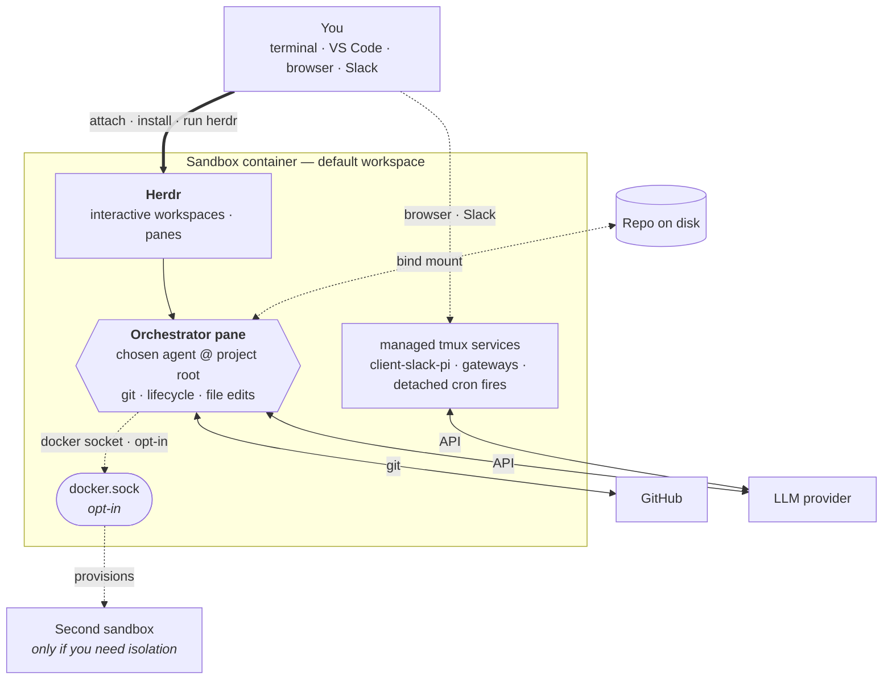

# AGRO

AGRO is your **portable harness**. Each sandbox has one repo. AGRO wraps your project in an isolated Docker container and versions the harness state in git. The repo tracks the identity, skills, crons, and memory of the agent in git. The sandbox keeps the agent off your host machine. The agent is Claude Code, Codex, Pi, or another agent of your choice. The agent owns its workspace and runs against your code. The croner runtime sends prompts to the agent on a schedule.

## What is AGRO?

AGRO is a single repo, and that repo *is* your harness. The harness boots one Docker container: the sandbox. The sandbox wraps your project.

To use the sandbox, do these steps:

1. Run `agro sandbox install docker` to start the sandbox.
2. Attach to the sandbox from your terminal or from VS Code.
3. Let your chosen agent work on the project over time.

Because the harness is a git repo, git tracks and versions the full harness setup. The setup is reproducible and portable. AGRO has no per-agent fan-out. One host CLI, `agro`, drives the full lifecycle. The croner runtime ships in the image and sends prompts to the agent on a schedule.

Key capabilities:

- **One repo, one sandbox.** Your portable harness is one repo, and that repo boots one container. The agent owns its workspace. Agents do not run directly on your host, so your machine stays clean.
- **Markdown-defined crons.** Each `crons/*.md` file declares a schedule. The croner runtime inside the container sends each file body to the agent as a prompt. The agent works autonomously while you focus on other tasks.
- **Host dependencies: Docker, Git, and Node.js ≥ 20.** Your laptop needs no Python, no pnpm, no agent CLIs, and no toolchain maintenance. Node runs the `agro` CLI and nothing else. If Node is missing, `get-agro.sh` installs Node for you. (See [Prerequisites](/docs/installation#prerequisites).)
- **Cloudflared previews.** Share sandbox app ports through Cloudflared tunnels. SSH and pack-supplied services remain opt-in Docker Compose overlays.
- **Multi-agent messaging.** Bridge Slack and other messengers to a Pi agent with the [`pi-messenger-bridge`](/docs/integrations/slack) npm package.

## How it works

The harness uses Docker Compose to build a sandbox image from `.devcontainer/`. The sandbox installs nothing at boot. Do these steps in this order:

1. On the host, run `agro sandbox install docker` to start the sandbox.
2. On the host, run `agro shell <name>` to attach to the sandbox. As an alternative, attach from VS Code.
3. In the sandbox, run `agro tool install herdr`.
4. In the sandbox, run `herdr`.
5. In a Herdr pane, authenticate GitHub.
6. In a Herdr pane, authenticate your chosen provider.
7. Start agents from Herdr panes.

To stop the sandbox and keep its state, run `agro stop`.

> **Warning:** `agro destroy` is the destructive teardown. The command deletes the volumes. Before the deletion, `agro destroy` asks you to confirm.

Every one of those verbs runs `.agro/scripts/docker-compose.sh`. See [lifecycle commands](/docs/lifecycle-commands).

The primary agent pane at the project root inside Herdr is your **orchestrator**. The orchestrator handles git, the sandbox lifecycle, and most file edits in that workspace.

The Docker socket is optional and is off by default. See [security-considerations.md](security-considerations.md#3-sandbox-isolation--the-docker-socket-caveat--enforced-with-a-caveat). If you enable the Docker socket, the orchestrator can also control other containers through that socket. The orchestrator can also edit files inside those containers through that socket. With the socket enabled, day-to-day work seldom needs other tools.

If a task cannot run inside the container, go back to the host shell. An example is a new bind-mounted volume. For that task, change `.devcontainer/docker-compose.yml` on the host, then restart the sandbox.

If you want isolation, start a **second sandbox**. A second sandbox runs with its own identity, branch, or provider key. Most users do not need a second sandbox.

Inside the sandbox, systemd runs `scripts/cron-runtime.ts` as `agro-cron.service`. The service reads `crons/*.md`. On the declared schedule, the service sends each file body as a prompt to the configured agent.

## How to read these docs

If you are new, read the pages in this order:

1. [Installation](/docs/installation) — install Docker, Git, and the `agro` CLI.
2. [Quickstart](/docs/quickstart) — go from zero to a running sandbox in under five minutes.

If a sandbox already runs, go directly to the page you need.

## Where to get help

- Source code and issues: [github.com/mifunedev/agro](https://github.com/mifunedev/agro)
- Learning material: [Resources](/docs/resources)
- Philosophy: [How AGRO embodies compound engineering](https://github.com/mifunedev/agro-web/tree/main/blog) — each unit of work here must make the next unit of work easier.

[Connecting to the Sandbox](/docs/connecting)
