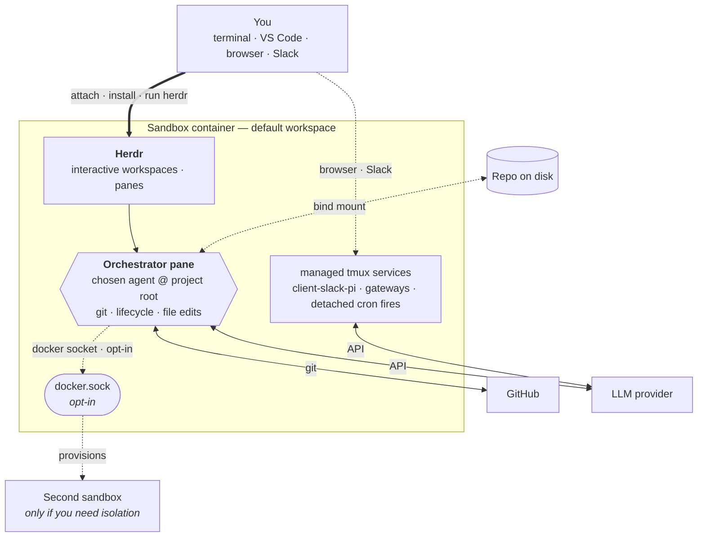

# AGRO

AGRO is your **portable harness**. Each sandbox has one repository. AGRO wraps your project in an isolated Docker container and versions the harness state in git. The repository tracks the agent's identity, skills, crons, and memory in git. The sandbox keeps the agent off your host machine. The agent is Claude Code, Codex, Pi, or another agent that you choose. The agent owns its workspace and runs against your code. A small croner runtime wakes the agent on a schedule.

## What is AGRO?

AGRO is a single repository, and that repository is your harness. The harness starts one Docker container, the sandbox, and wraps your project inside the sandbox. You start the sandbox with `agro sandbox install docker`. You then attach to the sandbox from your terminal or from VS Code. Your chosen agent then works on the project over time. The harness is a git repository, so git tracks and versions the full harness setup. Git tracking makes the setup reproducible and portable. AGRO has no per-agent fan-out. One host CLI, `agro`, drives the full lifecycle. The croner runtime ships in the image and wakes the agent on a schedule.

Key capabilities:

- **One repo, one sandbox.** Your portable harness is one repository, and the harness starts one container. The agent owns its workspace. Agents do not run directly on your host, so your host stays clean.
- **Markdown-defined crons.** Files that match `crons/*.md` declare schedules. A croner runtime inside the container fires each file body as an agent prompt. The agent then works autonomously while you focus on other work.
- **Host dependencies: Docker, Git, and Node.js ≥ 20.** Your laptop needs no Python, no pnpm, no agent CLIs, and no toolchain maintenance. Node runs the `agro` CLI and nothing else. If Node is missing, `get-agro.sh` installs Node for you. (See [Prerequisites](/docs/installation#prerequisites).)
- **Cloudflared previews.** Share sandbox app ports through Cloudflared tunnels. SSH and pack-supplied services remain opt-in Docker Compose overlays.
- **Multi-agent messaging.** The [`pi-messenger-bridge`](/docs/integrations/slack) npm package bridges Slack and other messengers to a Pi agent.

## How it works

Docker Compose builds the sandbox image from `.devcontainer/`. Nothing installs at boot. Run these steps in order:

1. On the host, run `agro sandbox install docker`. The sandbox starts.
2. On the host, run `agro shell <name>`. Your terminal attaches to the sandbox. You can attach with VS Code instead.
3. Inside the sandbox, run `agro tool install herdr`.
4. Inside the sandbox, run `herdr`. Herdr opens.
5. From a Herdr pane, authenticate GitHub.
6. From a Herdr pane, authenticate your chosen LLM provider.
7. Launch agents from Herdr panes.

`agro stop` stops the sandbox and preserves state. `agro destroy` is the destructive teardown. Before `agro destroy` deletes the volumes, the command asks for confirmation. Each of these verbs runs `.agro/scripts/docker-compose.sh`. See [lifecycle commands](/docs/lifecycle-commands).

Inside Herdr, the primary agent pane at the project root is your **orchestrator**. Git, sandbox lifecycle, and most file edits flow through the orchestrator pane. The Docker socket is optional and off by default. See [security-considerations.md](security-considerations.md#3-sandbox-isolation--the-docker-socket-caveat--enforced-with-a-caveat). If you enable the Docker socket, the orchestrator can drive other containers over that socket. The orchestrator can also edit files inside those containers. With the socket enabled, day-to-day work rarely needs another tool. Return to the host shell only for a task that the container cannot perform. One example is a new bind-mounted volume. A new bind-mounted volume needs a change to `.devcontainer/docker-compose.yml`. After that change, restart the sandbox with <restart command>.

Start a **second sandbox** only when you need isolation. A second sandbox runs on its own with an independent identity, branch, or provider key. Most users do not need a second sandbox.

Inside the sandbox, systemd runs `scripts/cron-runtime.ts` as `agro-cron.service`. The service reads `crons/*.md`. The service fires each file body as a prompt to the configured agent. Each prompt fires on the schedule that its file declares.

## How to read these docs

If you are new, read the pages in this order:

1. [Installation](/docs/installation) — install Docker, Git, and the `agro` CLI.
2. [Quickstart](/docs/quickstart) — go from zero to a running sandbox in under five minutes.

If a sandbox already runs, go directly to the page that you need.

## Where to get help

- Source code and issues: [github.com/mifunedev/agro](https://github.com/mifunedev/agro)
- Learning material: [Resources](/docs/resources)
- Philosophy: [How AGRO embodies compound engineering](https://github.com/mifunedev/agro-web/tree/main/blog) — why each unit of work here should make the next one easier.

[Connecting to the Sandbox](/docs/connecting)
