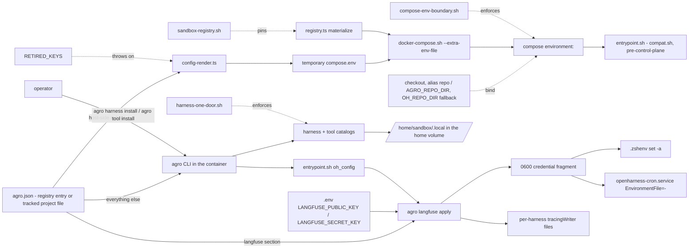

# Compose Environment Boundary

## Relevant Source Files
- `.devcontainer/docker-compose.yml` — the checkout-binding compose file; its `environment:` block is the surface this page constrains, and its bind and build context read `${AGRO_REPO_DIR:-${OH_REPO_DIR:-..}}`.
- `.devcontainer/docker-compose.image-only.yml` — the default base for a registry sandbox (no checkout); its `environment:` block is byte-identical to the other file's.
- `.devcontainer/entrypoint.sh` — the `oh_config` / `oh_config_truthy` helpers that read the config file at boot; installs nothing. It sources `/opt/agro-assets/.agro/scripts/compat.sh` on its first line (`.devcontainer/entrypoint.sh:5`), so the seed path recognizes `.oh/` or `.agro/`, either `.image-seeded` marker, and either seed directory before the control plane exists, and it resolves the control dir once into `CONTROL_DIR` (`.devcontainer/entrypoint.sh:242`) — see [[sandbox-dependency-installs]]. It also calls `langfuse_apply` after Python provisioning (`.devcontainer/entrypoint.sh:161-183`, invoked at `:258`).
- `.agro/cli/src/lib/config-render.ts` — renders the host-side subset into a temporary `compose.env`; refuses `RETIRED_KEYS`.
- `.agro/cli/src/lib/oh-config.ts` — `configCheckout(config)` (`oh-config.ts:98-101`), the one accessor every read of the bound-checkout path goes through; it also declares and validates the non-secret `langfuse` section (`oh-config.ts:68-93`, `oh-config.ts:234-239`).
- `.agro/cli/src/lib/secrets.ts`, `.agro/cli/src/lib/tracing/`, `.agro/cli/src/commands/langfuse.ts`, `.agro/install/.zshenv`, `.devcontainer/openharness-cron.service` — the third route: `.env` credentials, the renderers and the `tracingWriter` seam, the `apply` / `status` / `disable` verbs, and the two shell and systemd carriers of the credential fragment.
- `.agro/evals/probes/langfuse-shell-wiring.sh`, `.agro/evals/probes/langfuse-wizard-unattended.sh` — the tier-A probes that pin the fragment's two-consumer format and the wizard's no-TTY skip.
- `.agro/cli/src/lib/registry.ts` — materialises the base compose file, the overlays, the wrapper, `compat.sh`, and `check-host-port.sh` into a registry entry, which is the root the wrapper runs from; the two script destinations sit under the entry's *resolved* control dir (`resolveProjectLayout(entry).controlDir`).
- `.agro/cli/src/commands/harness.ts`, `.agro/cli/src/commands/tool.ts` — the only install door.
- `.devcontainer/Dockerfile`, `.agro/scripts/link-providers.sh` — the Hermes image default and additive integration validation.
- `.agro/evals/probes/compose-env-boundary.sh`, `.agro/evals/probes/harness-one-door.sh`, `.agro/evals/probes/sandbox-registry.sh` — the tier-A probes that enforce the rules, and pin the bundled compose texts to the tracked files.

## Summary
A value reaches the sandbox through Compose only if a process **outside** the sandbox — or the entrypoint **before** the control plane is readable — must act on it. Everything else lives in `agro.json` — the registry entry's for a sandbox created by `agro sandbox install docker` (#950), the tracked project file for in-repo settings — and is read inside the container through the CLI. Installs are not configuration at all: a harness or tool enters the sandbox only when the operator runs `oh harness install <id>` or `oh tool install <id>` (#948), so neither Compose nor `agro.json` carries an install key. Since #942 the rendered path keys carry the `AGRO_` prefix and every compose interpolation falls back through the legacy `OH_` spelling, so an entry rendered by an older CLI still resolves.

## Detail
Three routes carry configuration into the sandbox. The host-side route renders a fixed set — `SANDBOX_NAME`, `TZ`, `AGRO_HOME_MOUNT`, `AGRO_REPO_DIR`, `GIT_USER_NAME`, `GIT_USER_EMAIL`, `DOCKER_SOCKET`, `SANDBOX_SSH`, `SANDBOX_SSH_PORT`, `AGRO_SANDBOX_IMAGE`, `AGRO_PULL_POLICY` (`.agro/cli/src/lib/config-render.ts:38-51`) — because each selects an overlay, names the project, publishes a port, binds a path, or is needed before `agro.json` is reachable. Only the four prefixed keys were respelled in #942; `SANDBOX_NAME`, `TZ`, the two git identities and the three access keys carry no product prefix and never changed. The set is rendered into a temporary `compose.env` passed to the wrapper as `--extra-env-file`; nothing writes a `.devcontainer/.env`. Both compose files read every prefixed key through one two-step fallback, `${AGRO_<KEY>:-${OH_<KEY>:-<default>}}`, so a registry entry whose `compose.env` an older CLI rendered still resolves and either spelling works. `AGRO_REPO_DIR` is the one entry that is a path rather than a setting: it is the absolute checkout a registry sandbox binds at `/home/sandbox/harness`, rendered only when the config carries that checkout path — `put("AGRO_REPO_DIR", configCheckout(config))` (`.agro/cli/src/lib/config-render.ts:41`), where `configCheckout` returns `config.checkout ?? config.repo` and reads an empty string as absent (`.agro/cli/src/lib/oh-config.ts:98-101`), so the `checkout` field and its alias `repo` render the same variable and `checkout` wins when a file holds both. The key itself keeps the `AGRO_REPO_DIR` spelling; only the source of its value moved. The compose file's `${AGRO_REPO_DIR:-${OH_REPO_DIR:-..}}` default keeps an in-checkout or CI run identical to before #950. The unnamed fallback identity is now `agro`: the compose `name:`, `container_name:`, and the build flavour's default image read `${SANDBOX_NAME:-agro}` and `sandbox-${SANDBOX_NAME:-agro}`. This repository's own `agro.json` declares no `name` at all, so `put("SANDBOX_NAME", config.name)` renders nothing and its project name, container name and volume prefix all resolve through the `agro` fallback. A registry entry under `<registry home>/sandboxes/<name>/` is itself a root, and the home resolves through `resolveUserStateHome` — `AGRO_HOME`, then `OH_HOME`, then `~/.agro` unless a legacy `~/.oh/sandboxes` is the only registry present. The CLI materialises the compose base, the overlays and the scripts into the entry on every lifecycle call (`.agro/cli/src/lib/registry.ts`), so the wrapper's `--repo-dir` is the entry and the checkout, when there is one, arrives only through `AGRO_REPO_DIR`. The in-container route reads everything else at the moment it is needed: `oh_config` shells `<CLI_BIN> config show` once — `CLI_BIN` is `compat_env_value BIN` with the default `agro` (`.devcontainer/entrypoint.sh:139-140`) — and answers `jq` filters from the cached JSON, degrading to a caller-supplied default when the CLI is missing or old; `config show` rather than a narrower verb, because a baked CLI can predate a new one on the boot path.

Installs take neither route. Boot provisioning, the `install.*` keys, the persist flags, the boot-time environment off-ramp and the healthcheck failure marker were retired in #948. `oh harness install <id>` and `oh tool install <id>` probe the running sandbox, install as the sandbox user into `NPM_USER_PREFIX` (`/home/sandbox/.local`) inside the home volume, verify with the catalog's `verifyArgv`, and report; they touch no `agro.json` field. The host install path that #1086 reshaped carries neither key either: `harness install --host` and `tool install --host` resolve an existing workspace under `~/.agro/workspaces/`, create none, and record that root as `harnessRoot` in the host `~/.agro/config.json` beside a per-entry receipt under `hostHarnesses` or `hostTools`. Kinds are `installable` / `on-demand` for harnesses and `baked-in` / `installable` for tools; the catalogs own every pin and checksum, and `entrypoint.sh` holds none. A fresh home volume boots with no harness and no `herdr`, and the healthcheck passes anyway.

Four compose `environment:` literals survive that no config read can supply: `SANDBOX_PASSWORD` (consumed by the entrypoint's own user setup), `CLAUDE_DANGEROUSLY_SKIP_PERMISSIONS`, `CC_SAFETY_NET_STRICT` and `CC_SAFETY_NET_WORKTREE` (read by third-party binaries that know nothing of `agro.json`), plus the `GH_TOKEN` secret, which `config-render.ts` refuses to render.

The third route carries Langfuse tracing, and the compose boundary is why it exists: every consumer is an in-sandbox harness, so no process outside the sandbox must act on these values and `compose-env-boundary.sh` admits none of them. No `LANGFUSE_*` key appears in any compose file, and `RETIRED_KEYS` still throws on `LANGFUSE_BASE_URL` and `LANGFUSE_PRIVACY_PRESET` (`.agro/cli/src/lib/config-render.ts:22-23`). The settings split by secrecy instead. `enabled`, `baseUrl`, `environment` and `userId` are non-secret and live in the `agro.json` `langfuse` section; `LANGFUSE_PUBLIC_KEY` and `LANGFUSE_SECRET_KEY` are in `SECRET_KEYS` (`.agro/cli/src/lib/secrets.ts:16-17`), which is what makes `renderComposeVars` throw if either is ever put. `agro langfuse apply` reads both and renders one `0600` fragment at `~/.config/agro/langfuse.env` holding four bare `KEY=value` lines (`.agro/cli/src/lib/tracing/providers/langfuse.ts:16-27`, `.agro/cli/src/lib/tracing/writer.ts:20-34`) — bare, because systemd `EnvironmentFile` rejects `export`. The tracked `.zshenv` sources it inside `set -a` / `set +a` so children inherit it (`.agro/install/.zshenv:1-5`), and `openharness-cron.service` reads the same file through an optional `EnvironmentFile=-`, so no attached terminal is the carrier. Per-harness non-secret files come from an optional `tracingWriter` on the catalog entry (`.agro/cli/src/lib/harnesses/catalog.ts:22`): Claude Code merges two keys into `~/.claude/settings.json`, Pi writes `~/.pi/agent/langfuse.json`, Codex writes a `0600` `~/.codex/langfuse.json`. Every generated file is a derived artifact — `agro.json` and `.env` are the only sources of truth, each render is idempotent, and `agro langfuse status` reports a hand-edit as drift. The interactive wizard is `agro config langfuse`, the first member of the `INTEGRATIONS` registry (`.agro/cli/src/cli.ts:91-100`), and it skips itself without a TTY.

Four guards keep the boundary closed. `RETIRED_KEYS` throws if a `put()` for a retired variable is ever re-added (`.agro/cli/src/lib/config-render.ts`); the compose probe fails on any `INSTALL_*` key, on `OH_IMAGE_ONLY`, or on any `environment:` key outside the rendered set — across every `docker-compose*.yml` including overlays; and `harness-one-door.sh` fails on a `default` kind, a `harnessKey` / `toolKey`, a provisioner script, an `install` key in `oh-config.ts`, a boot-time provisioning gate, or an installable binary in the Dockerfile. `sandbox-registry.sh` compares the seven texts a materialised entry can contain (the two bases, the two overlays, wrapper, port check, `compat.sh`) against the tracked files byte for byte, asserts that a legacy `oh.json` entry keeps materialising under `.oh/scripts/` while a fresh `agro.json` entry gets `.agro/scripts/` and never both, and fails if a lifecycle verb spawns `docker` outside the wrapper. One `materialize()` call writes **six** files: one compose base (image-only without the checkout path, checkout-binding with it — `materialize()` selects on `opts.checkout ?? opts.repo`), the ssh and docker-sock overlays, and `docker-compose.sh`, `compat.sh`, `check-host-port.sh` under `resolveProjectLayout(entry).controlDir`. The config file is written separately by `runSandboxInstall` through `writeOhConfig`, which resolves the same pair and so writes `agro.json` for a fresh entry and `oh.json` for a legacy one. Overlay `ports:` and `volumes:` blocks are unrestricted; that payload is the part only Docker can act on.

Non-goals: the image-only base is the default for a registry sandbox, because the image stages one seed at `/opt/agro-seed` regardless (`compat_seed_src` still prefers a legacy `/opt/oh-seed` when an older image carries one); `INSTALL_PYTHON_KERNEL` and `provision-python.sh` remain, a Dockerfile↔entrypoint duplication rather than a compose one; `start_period: 600s` was sized for the retired provisioning window and is tracked for retuning on #948. The compose `healthcheck:` is the one compose field that carries a control-plane path: it is a `bash -c` line that runs `.agro/scripts/sandbox-healthcheck.sh` when `.agro/` exists and otherwise falls through to `.oh/`, resolving at run time rather than at render time, because the compose text is materialised before the workspace volume is seeded.

Hermes adds a sandbox-internal default, not a Compose setting. The image sets
`HERMES_HOME=/home/sandbox/harness/.hermes` (`.devcontainer/Dockerfile:4`). Managed
installation validates the launch home and reconciles additive shared skills before
installation, verifies the executable, and reconciles again afterward
(`.agro/cli/src/commands/harness.ts:661`, `.agro/cli/src/commands/harness.ts:692`).
The canonical linker refuses unset or relative managed launch homes and conflicting
occupied paths (`.agro/scripts/link-providers.sh:197-210`). Ordinary provider linking in another
worktree does not redirect the image-global Hermes runtime
(`.agro/scripts/link-providers.sh:192-195`). No Compose variable or install setting changed.

## System Relationships

## See Also
- [[sandbox-dependency-installs]]
- [[oh-cli-portable-lifecycle]]
