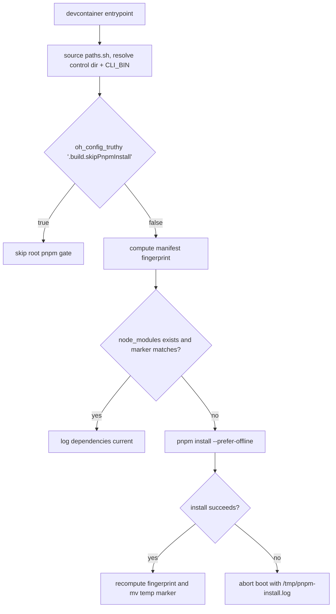

# Sandbox Dependency Installs

## Relevant Source Files
- `.devcontainer/entrypoint.sh` — owns devcontainer boot, root dependency install decisions, marker refresh, and skip/failure behavior. It sources `paths.sh` before anything else (`:5`) and resolves the control dir once (`:242`), so the gate's config read works against a `.agro/` or a `.agro/` workspace.
- `.agro/scripts/__tests__/entrypoint-pnpm-install.test.ts` — Vitest contract coverage for the install gate.
- `.agro/evals/probes/entrypoint-pnpm-manifest-fingerprint.sh` — Tier-A eval probe guarding the same boot-path contract.
- `.github/workflows/sandbox-boot-guard.yml` — CI boot guard path that preseeds dependencies and then sets `build.skipPnpmInstall` in `agro.json` (`:173-182`); it does **not** set an environment variable.

## Summary
The devcontainer root `pnpm install` gate is manifest-aware: it keeps the fast boot path when the installed tree matches current package manifests, but reinstalls when the marker under `node_modules` is missing or stale. The marker exists because the harness checkout is bind-mounted at runtime, so Dockerfile-time installs can be shadowed and a long-lived `node_modules` directory is not enough evidence by itself.

## Detail
The root install block explains the runtime shadowing problem and uses `build.skipPnpmInstall` in `agro.json` as the explicit opt-out for externally managed or air-gapped dependency state. Compose no longer carries that flag: `#920` moved it onto the CLI route, so the entrypoint reads it with `oh_config_truthy '.build.skipPnpmInstall'` at the gate (`.devcontainer/entrypoint.sh:520`) and the CI boot guard sets it by patching `agro.json` (`.github/workflows/sandbox-boot-guard.yml:181`). That read goes through the compat-resolved CLI: `entrypoint.sh:5` sources `paths.sh`, `:139-140` sets `CLI_BIN` from `agro_env_value BIN` with the default `agro`, and `oh_config` shells `<CLI_BIN> config show` from `$HARNESS`, so the opt-out resolves from `agro.json` or a legacy `agro.json` without the gate knowing which. See [[compose-env-boundary]]. The entrypoint derives workspace package patterns from `pnpm-workspace.yaml`, ignores negated patterns, and does not include undeclared package-local manifests (`.devcontainer/entrypoint.sh:418-420`, `.devcontainer/entrypoint.sh:434`, `.devcontainer/entrypoint.sh:503`). Manifest discovery excludes dependency and runtime/vendor paths such as `.git`, `.worktrees`, `projects`, `node_modules`, `.pi/npm/node_modules`, `.agro/cli/node_modules`, and `.hermes/lsp/node_modules` via the broad `*/node_modules/*` guard (`.devcontainer/entrypoint.sh:463-470`).

The fingerprint helper includes existing root `package.json`, `pnpm-lock.yaml`, and `pnpm-workspace.yaml`, plus package manifests from declared workspace package patterns, sorts normalized relative paths bytewise, hashes each file with `sha256sum`, and hashes the ordered manifest list into one final digest (`.devcontainer/entrypoint.sh:510`, `.devcontainer/entrypoint.sh:513`, `.devcontainer/entrypoint.sh:514`, `.devcontainer/entrypoint.sh:516-517`). The install marker is `.agro-root-pnpm-manifest.sha256` stored under `$HARNESS/node_modules`, tying the digest to the dependency tree it validates (`.devcontainer/entrypoint.sh:521`, `.devcontainer/entrypoint.sh:522`). The marker filename kept the `agro` spelling through #942 — renaming it would invalidate every existing dependency tree on the next boot.

There are three boot states. Missing `node_modules` runs `pnpm install --prefer-offline`; a missing or mismatched marker logs `manifest drift detected; reinstalling`; a matching marker logs `dependencies current` and skips install (`.devcontainer/entrypoint.sh:526`, `.devcontainer/entrypoint.sh:529`, `.devcontainer/entrypoint.sh:530`, `.devcontainer/entrypoint.sh:533`). After a successful install, the entrypoint recomputes the fingerprint, writes a temp marker beside the final marker, and atomically moves it into place; marker-refresh or install failures still abort boot with `/tmp/pnpm-install.log` diagnostics (`.devcontainer/entrypoint.sh:538`, `.devcontainer/entrypoint.sh:539`, `.devcontainer/entrypoint.sh:540`, `.devcontainer/entrypoint.sh:543`, `.devcontainer/entrypoint.sh:547`).

The Vitest file asserts the agro.json opt-out read, the absence of `SKIP_PNPM_INSTALL` from both the entrypoint and compose, marker filename and location, the `pnpm_manifest_fingerprint` helper shape, drift reinstall branch, current-dependencies skip branch, atomic refresh, and install-failure abort behavior (`.agro/scripts/__tests__/entrypoint-pnpm-install.test.ts:16`, `:21`, `:25`, `:30`, `:38`, `:44`, `:49`, `:56`). The Tier-A probe checks the same contract from the eval suite and returns a regression if any expected source, compose, or test signal disappears (`.agro/evals/probes/entrypoint-pnpm-manifest-fingerprint.sh:37`, `.agro/evals/probes/entrypoint-pnpm-manifest-fingerprint.sh:45`, `.agro/evals/probes/entrypoint-pnpm-manifest-fingerprint.sh:46`, `.agro/evals/probes/entrypoint-pnpm-manifest-fingerprint.sh:59`).

Non-goals remain explicit: this does not change global package installs, delete or prune `node_modules`, alter optional agent-browser installs, change `.agro/cli` package-local installation, or migrate away from pnpm. Safe manual recovery is to remove only the marker file, run root `pnpm install --prefer-offline`, or set `build.skipPnpmInstall` in the workspace config while diagnosing. **`SKIP_PNPM_INSTALL` no longer exists**: it is in `config-render.ts`'s `RETIRED_KEYS`, the Vitest file asserts it is absent from both the entrypoint and compose, and the Tier-A probe returns a REGRESSION if it reappears in a compose file (`.agro/evals/probes/entrypoint-pnpm-manifest-fingerprint.sh:42-44`).

## System Relationships

## See Also
- [[compose-env-boundary]]
- [[recursive-language-models]]
