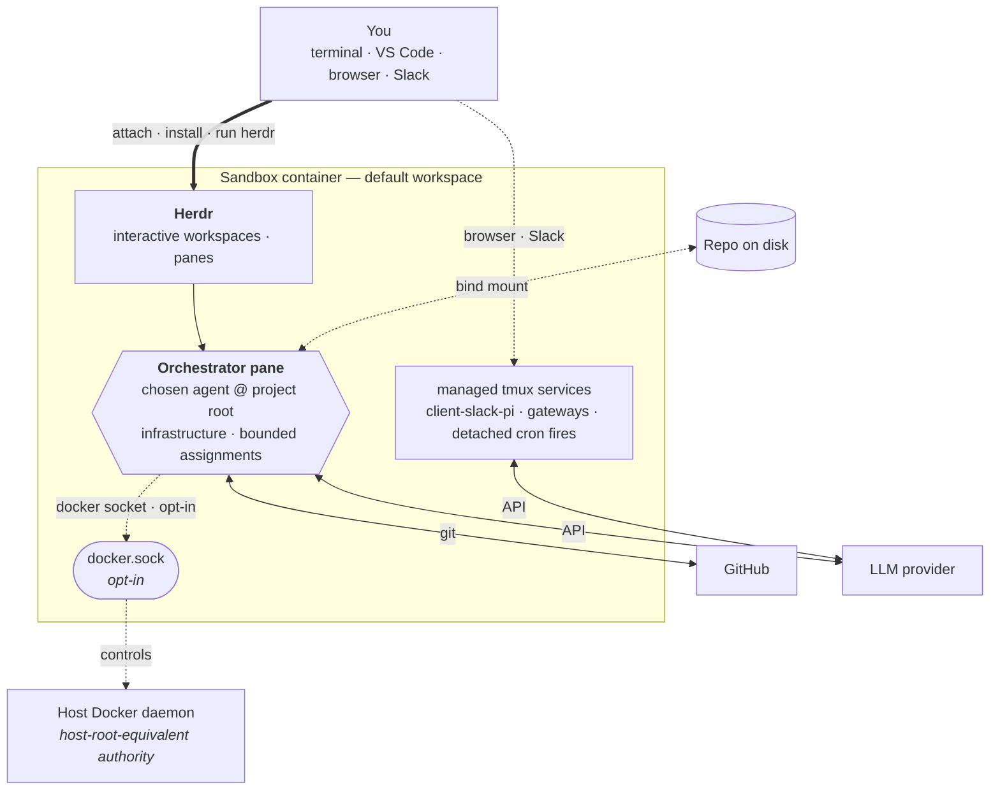

# AGRO — Open Harness

AGRO gives your chosen coding harness a durable workspace and shared control plane, locally or on a remote VM. You own the workspace. Keep tools, project state, schedules, and communication settings together across sessions. Shared procedures, bounded delegation, and evidence checks support reviewable agent work.

## What is Open Harness?

AGRO surrounds Claude Code, Codex, Pi, or another coding harness; it does not replace the harness. `.devcontainer/` defines the Docker runtime. `.agro/` provides shared skills, hooks, task procedures, and checks. This open control plane is not Mifune's proprietary hosted fleet-management platform. See the [open-core boundary](open-core.md).

The recommended path needs no fork or host-side harness checkout. Start from the published image with `agro sandbox install docker`. For an existing project, you can bind a checkout with `--repo`. Version selected project files in git; keep credentials and runtime state outside tracked files.

Key capabilities:

- **A durable workspace.** Agents develop inside the sandbox, with tools and state in the persistent home mount.
- **Separate parallel changes.** Bounded workers use separate git worktrees. Worktrees separate checkouts, not security boundaries; provider capabilities and enforcement differ.
- **Markdown-defined crons.** `crons/*.md` files declare schedules; an in-container croner runtime fires the bodies as agent prompts so the agent can work autonomously while you focus on other things.
- **Host dependencies: Docker with Compose, Git, and Node.js ≥ 20.** Run coding harnesses and development tools inside the sandbox. See [Prerequisites](installation.md#prerequisites).
- **Cloudflared previews.** Share sandbox app ports through Cloudflared tunnels; SSH and pack-supplied services remain opt-in Docker Compose overlays.
- **Multi-agent messaging.** Bridge Slack (and other messengers) to a Pi agent with the [`pi-messenger-bridge`](/docs/integrations/slack) npm package; SSH and pack-supplied services remain opt-in Docker Compose overlays.

## How it works

On the **host**, run `agro sandbox install docker`, then `agro shell <name>`. Inside the **sandbox**, run `agro tool install herdr`, then `herdr`. Install and authenticate Claude Code in a Herdr pane. Follow [Quickstart](quickstart.md#first-task-create-and-verify-a-program) to create and verify a small program in a new scratch directory. GitHub setup is optional until you need GitHub repository access.

Installable harnesses and tools need explicit commands. Bootstrap can install workspace dependencies. Use [lifecycle commands](lifecycle-commands.md) to inspect or manage the sandbox. `agro update` upgrades the CLI; the legacy `oh update` command instead vendors the project payload.

The root orchestrator manages harness infrastructure and bounded assignments. Application agents develop inside their assigned sandbox workspaces. Use Herdr for interactive work and named tmux sessions for headless gateways and tunnels.

Leave the host Docker socket disabled unless its authority is required: socket access is effectively host root. Sudo access and permission-skipping agent aliases also require trust. Read [security considerations](security-considerations.md) before granting credentials or mounts.

Local and remote operation both require a running host and container for live processes. Home-mount files persist across stops; running agents and servers do not. Before destructive teardown with `agro destroy`, back up workspace data and credentials. See [Quickstart cleanup](quickstart.md#stop-or-destroy) for host commands and the host-bind exception.

Inside the sandbox, systemd runs `.agro/scripts/cron-runtime.ts` as `openharness-cron.service`, which reads `crons/*.md` and fires each body as a prompt to the configured agent on its declared schedule.

## How to read these docs

If you are new, follow this order:

1. [Installation](installation.md) — install Docker, Git, Node, and the `agro` CLI.
2. [Quickstart](quickstart.md) — create the sandbox and complete a first task with observable output.

If you already have a sandbox running, jump directly to the page you need.

## Where to get help

- Source code and issues: [github.com/mifunedev/agro](https://github.com/mifunedev/agro)
- Learning material: [Resources](/docs/resources)
- Philosophy: [How Open Harness embodies compound engineering](https://github.com/mifunedev/agro-web/tree/main/blog) — why each unit of work here should make the next one easier.

[Connecting to the Sandbox](/docs/connecting)
